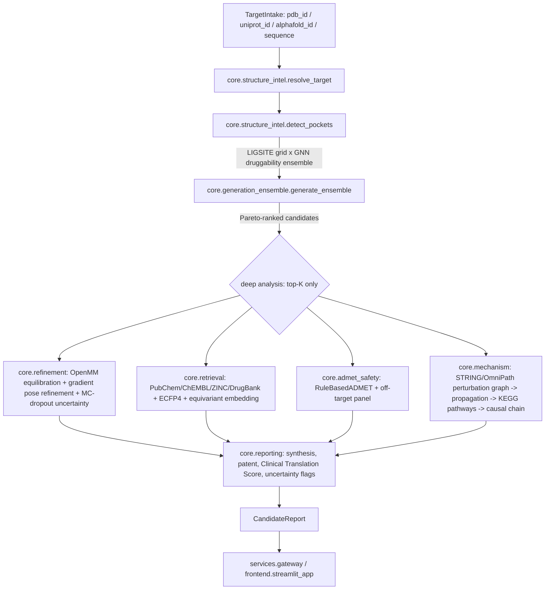

# BioForge Architecture

## Module map

```
engines/pharmaforge_core/     vendored engine (see its own docs/architecture.md)
src/bioforge/
├── common/          schemas.py (the cross-service contract), config.py, provenance.py, messaging.py
├── core/             framework-free science logic - the layer every service actually wraps
│   ├── structure_intel.py     intake (PDB/UniProt/AlphaFold DB) + pocket ensemble (LIGSITE-grid x GNN)
│   ├── generation_ensemble.py generator adapters + multi-objective Pareto ranking
│   ├── refinement.py          OpenMM equilibration, gradient pose refinement, MC-dropout uncertainty
│   ├── retrieval.py           PubChem/ChEMBL/ZINC/DrugBank search, ECFP4, equivariant embedding, pharmacophore
│   ├── admet_safety.py        RuleBasedADMET wrapper + off-target panel screen
│   ├── mechanism.py           perturbation graph, network propagation, pathway analysis, causal narrative
│   └── reporting.py           synthesis/patent/clinical-translation-score/uncertainty-flags/polypharmacology data
├── services/          one FastAPI app per stage, thin wrappers over core/
├── orchestrator/      graph.py - the LangGraph StateGraph tying every stage together
├── sdk/               BioForgeClient
└── cli.py             `bioforge run` / `bioforge serve <service>`
frontend/streamlit_app/  dashboard
```

The rule of thumb, inherited from the vendored engine: **`core/` never
imports FastAPI**, and `services/*/main.py` never contains business logic
beyond request validation and calling into `core/`. This is what makes every
`core/` function directly unit-testable without spinning up a server, and
what makes it possible to later swap a node's execution target (in-process
call vs. HTTP call vs. Celery task) without touching its logic.

## End-to-end data flow



## Why deep analysis only runs on the top-K candidates

`orchestrator/graph.py`'s `node_deep_analysis` deliberately runs refinement/
retrieval/ADMET/mechanism on the top `_TOP_K_FOR_DEEP_ANALYSIS` (default 3)
Pareto-ranked candidates, not every generated molecule. Each of those four
stages makes multiple real network calls or runs real physics (OpenMM,
gradient-based pose optimization) - genuinely expensive per candidate. This
mirrors how a real discovery pipeline works: generate broadly and cheaply,
then spend the expensive analysis budget on the shortlist. Raise `_TOP_K_FOR_DEEP_ANALYSIS`
in a batch/offline job when you want full-pool coverage.

## The generative ensemble

`core/generation_ensemble.py`'s `_ADAPTERS` registry currently has one real
entry (`EquivariantDiffusionGenerator`, wrapping the vendored, tested
E(3)-equivariant diffusion model) and three documented stubs (`DiffSBDDAdapter`,
`DiffDockLAdapter`, `LatentDiffusionAdapter`) that raise `NotImplementedError`
with a pointer to what's missing. `generate_ensemble` calls every requested
adapter and skips (logs, doesn't crash the request) any that raise -
`generators=["equivariant_diffusion", "diffsbdd"]` today silently runs only
the former. Ranking (`multi_objective_rank`) is real regardless of how many
generators actually contributed to the pool: it's a genuine non-dominated
sort (reusing the vendored engine's `pareto_front_indices`, the same routine
its Selectivity Profiler uses) over predicted affinity, QED, synthetic
accessibility, and a lightweight ADMET-desirability proxy.

## The mechanism module's honesty boundary

`core/mechanism.py` computes a real perturbation graph and a real network
propagation (personalized PageRank / random-walk-with-restart) over it. That
is a genuine, widely-used systems-biology technique for estimating a
perturbation's downstream reach - and a *weaker* one than a rigorous
do-calculus causal effect estimate, which would need an explicit structural
causal model and interventional/observational data this platform doesn't
have. `DoWhyCausalRefinement` documents that gap as an extension point
rather than silently overclaiming "causal inference" for what is actually
network propagation. Every other "real but simplified" boundary in the
codebase (the LIGSITE-style pocket grid vs. a production cavity detector,
the generic elastic-network OpenMM force field vs. a validated GAFF2/OpenFF
parameterization, gradient-based pose refinement vs. GNINA/DiffDock) follows
the same pattern - see `docs/whitepaper.md` for the full list.

## Known scope limits

- No generative/scoring checkpoint here is trained on real binding data
  (PDBbind/CrossDocked2020) - see `engines/pharmaforge_core/docs/whitepaper.md`.
- DiffSBDD, DiffDock-L, a fine-tuned latent-diffusion model, Boltz-1, Chai-1,
  AlphaFold3, GNINA, and FEP+/metadynamics are all documented,
  `NotImplementedError` extension points, not vendored weights/binaries.
- DrugBank and SureChEMBL both need a commercial license/API key BioForge
  doesn't ship; without one, retrieval/patent-landscape checks return a
  small, clearly-labeled bundled sample instead of live data.
- The ZINC22 live-search call (`core/retrieval.search_zinc`) has not been
  verified against current API documentation in this environment - see its
  docstring.
