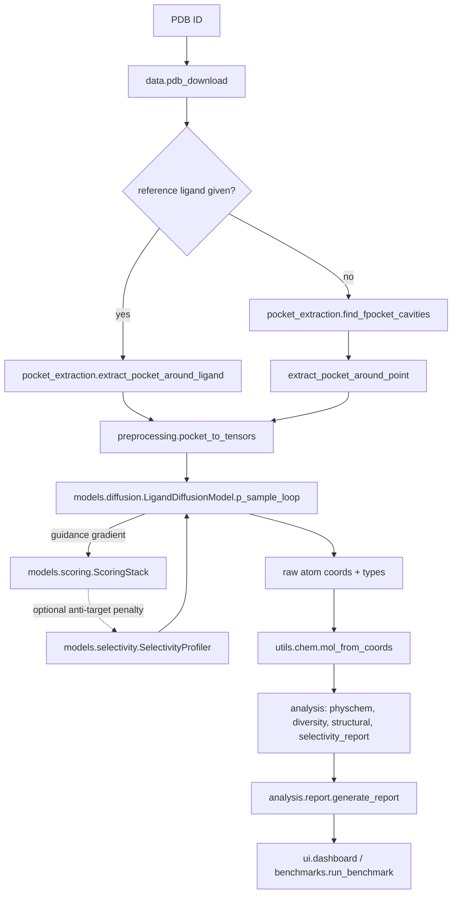

# PharmaForge Architecture

## Module map

```
pharmaforge/
├── config.py          # dataclass configs shared by every module (single source of truth)
├── data/               # PDB acquisition, pocket extraction, protonation, dataset loaders
├── models/             # architecture definitions only: EGNN, diffusion, actor-critic, scoring, selectivity
├── generation/          # orchestrates models + data into a generation run (sampler, fragment growing, pipeline)
├── scoring/             # inference-time wrappers: surrogate binding model, ADMET, retrosynthesis
├── analysis/            # structural / physchem / diversity / selectivity reporting + HTML report assembly
├── training/             # one entry-point script per trainable model
├── benchmarks/           # comparison harness against published SBDD baselines
└── ui/                  # Streamlit dashboard
```

The rule of thumb: **`models/` never does I/O**, `data/` never imports `models/`,
and `generation/`/`analysis/` are the only layers allowed to import from both.

## End-to-end data flow



## Why this replaces AlphaDrug's pipeline

| AlphaDrug | PharmaForge |
|---|---|
| SMILES-token autoregressive Lmser Transformer | 3D E(3)-equivariant diffusion (`models/egnn.py`, `models/diffusion.py`) generating atomic coordinates directly inside the pocket |
| Sequence-only protein conditioning | 3D pocket graph conditioning: atom coordinates + physicochemical features per pocket atom |
| External SMINA docking call inside every MCTS rollout | Differentiable neural scoring stack (`models/scoring.py`), milliseconds per call, gradient w.r.t. atomic coordinates |
| Vanilla discrete MCTS | Guided-diffusion sampling (gradient guidance from the scoring stack) as the primary mode, plus `DifferentiableTreeSearch` (`models/actor_critic.py`) for discrete fragment-growing, both critic-scored directly instead of via rollout statistics |
| Single-objective (dock score) | Multi-objective **Selectivity Profiler** (`models/selectivity.py`): NSGA-III/MOEA-D or constrained-guidance sampling against an arbitrary anti-target panel, reporting a selectivity index per molecule |

## The EGNN backbone (`models/egnn.py`)

One `PocketConditionedEGNN` is shared (same architecture, separately trained
weights) across the diffusion denoiser, the scoring stack, and the actor.
Every forward pass takes a single combined pocket+ligand graph:

- Pocket atom coordinates are **never updated** (`update_mask=is_ligand`) -
  the receptor is treated as rigid, matching how PDBbind/CrossDocked2020
  complexes are prepared (a fixed protein conformation per entry).
- Ligand atom coordinates *are* updated at every message-passing layer -
  this is what the diffusion model denoises, what the actor perturbs when
  growing a fragment, and what the scoring stack reads to predict affinity.
- Node features come from atom/residue-type embeddings plus a
  physicochemical vector (`data/preprocessing.py: PHYSCHEM_DIM = 6`):
  hydrophobicity, H-bond donor/acceptor flags, partial charge, van der
  Waals radius, aromaticity.

Equivariance is verified directly in `tests/test_egnn.py`: rotating and
translating the input pocket+ligand graph produces an identically rotated/
translated ligand output, with node scalar features (`h`) exactly invariant,
up to floating-point tolerance.

## The Selectivity Profiler (`models/selectivity.py`)

Two complementary mechanisms, both built on the same `MultiTargetScoringEnsemble`:

1. **Constrained guidance sampling** - `SelectivityProfiler.constrained_guidance_score`
   plugs straight into `LigandDiffusionModel.p_sample_loop`'s `guidance_fn`
   slot: `score = target_affinity - penalty_weight * sum(relu(offtarget_affinity))`.
   Selectivity is enforced *during* generation via the same gradient-guidance
   mechanism already used for on-target affinity, not as a post-hoc filter.

2. **Population-level Pareto analysis** - `pareto_front_indices` runs
   non-dominated sorting directly over an already-generated, already-scored
   candidate pool (primary ΔG to minimize, every anti-target ΔG to maximize),
   which is what the dashboard's Pareto-front browser uses. `run_multi_objective_search`
   additionally exposes a proper NSGA-III/MOEA-D (via `pymoo`) combinatorial
   subset-selection formulation for picking a fixed-size candidate shortlist
   under a multi-objective budget.

Every molecule gets a **selectivity index** SI = Kd_offtarget / Kd_target
(via `delta_g_to_kd`, ΔG → Kd through the standard ΔG = RT·ln(Kd) relation),
reported per anti-target so a medicinal chemist can see exactly which
off-target is the binding liability, not just an aggregate score.

## Known scope limits (see `docs/whitepaper.md` for full detail)

- No checkpoint trained on real PDBbind/CrossDocked2020 data ships with this
  repository - training requires a GPU and a multi-GB dataset download this
  development environment didn't have.
- `scoring/admet.py`'s `RuleBasedADMET` is a descriptor-based heuristic
  (BOILED-Egg-style), not a trained ADMET model; `LearnedADMET` is a
  documented, unimplemented extension point.
- `benchmarks/baselines.py`'s literature numbers are reconstructed from
  memory for scaffolding purposes and are explicitly flagged as
  "verify before citing" - they are not re-derived by running those models.
